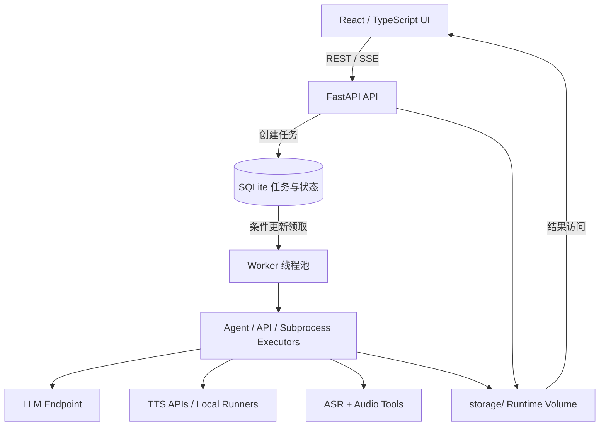
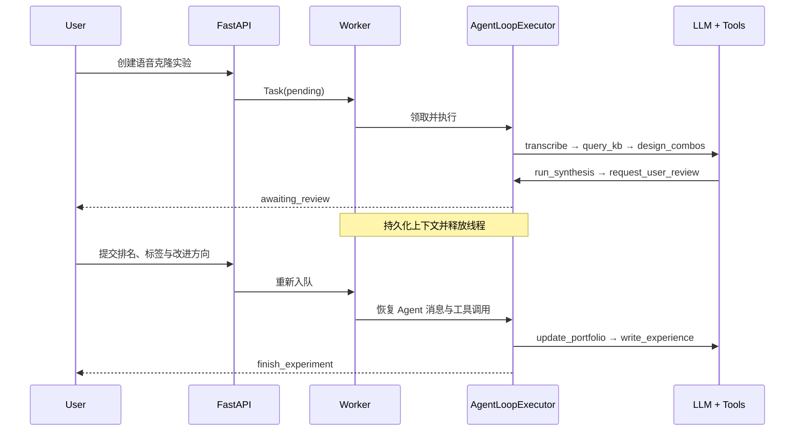

# AI Workflow Platform

一个面向语音算法实验的全栈工作台，将语音克隆策略探索、批量合成、人工评价和数据集整理组织成可暂停、可恢复的 Agent 工作流。

> 本仓库是脱敏后的公开版本，不包含模型权重、训练数据、运行数据库、生成音频、内部服务地址或访问凭证。各 TTS/ASR/LLM 服务需要自行配置。

## 核心能力

- **长任务编排**：FastAPI 与独立 Worker 解耦，通过 SQLite 条件更新领取任务，在线程池中执行并用 SSE 推送状态。
- **HITL 恢复**：持久化 Agent 消息、工具调用标识和阶段状态；人工评价期间释放执行线程，提交反馈后重新入队并恢复上下文。
- **语音克隆实验 Agent**：Tool Calling 串联参考音频转写、实验组合设计、多模型合成、人工排名和策略档案更新。
- **数据处理 Agent**：以多阶段状态机组织预处理、分类、ASR、人工校对与完整性检查；LLM 负责不确定决策，确定性工具负责文件与音频操作。
- **多模型适配**：提供统一的输入输出抽象，支持 API 模型、本地 runner 与 Triton/gRPC 服务的扩展接入。

## 功能地图

| 模块 | 作用 | 关键机制 |
| --- | --- | --- |
| PromptLab | 多模型语音克隆对比与策略探索 | Agent Loop、Tool Calling、HITL、策略档案 |
| Data Ingest Agent | 将原始音频整理为标准训练数据 | 12 阶段状态机、人工断点、确定性音频工具 |
| Batch TTS | 文本列表的多模型批量合成 | 统一执行器、后台任务、结果归档 |
| Knowledge Base | 沉淀模型档案、实验经验与策略因子 | Markdown 知识库、实验后聚合、覆盖矩阵 |
| Offline Evaluation | 匿名盲听与模型横向比较 | 随机化样本、人工评分、结果汇总 |
| Model Registry | 管理 API/GPU 模型及参数 Schema | 统一模型描述、运行方式与可用性 |

## 架构



API 进程负责请求、文件和状态查询；Worker 负责领取并执行长任务。`awaiting_review` 状态会保存待续接的工具调用，避免人工等待占用执行线程。

### PromptLab Agent Loop



### 数据处理 Agent

```text
preview → classify → classify_review → classify_confirm → metadata
→ pre_asr_preprocess → segment_confirm → asr
→ post_asr_preprocess → review_session → done
```

分类、元数据推断等不确定环节由 LLM 决策；文件移动、音频处理、完整性检查等环节由确定性工具执行。分类脚本需经过 AST 检查、操作级别判断、路径约束、dry-run 和受控子进程执行。

## 关键设计

| 设计 | 说明 |
| --- | --- |
| API / Worker 分离 | HTTP 请求只负责入队，长任务由独立 Worker 执行 |
| 原子任务领取 | 通过条件更新避免多个 Worker 重复领取同一任务 |
| HITL 暂停恢复 | 保存 Agent messages 与待续接 tool call，人工反馈后恢复 |
| 混合执行策略 | LLM 负责开放式判断，确定性工具负责可验证操作 |
| 经验闭环 | 将排名、问题标签与改进方向回注下一轮，并沉淀为策略档案 |
| 数据保护 | 源数据不原地修改，关键文件操作后执行完整性检查 |

## 目录结构

```text
backend/
  api/          FastAPI 路由
  executors/    Agent、TTS、子进程与数据处理执行器
  models/       SQLAlchemy 数据模型
  pipeline/     确定性数据与推理管线
  runners/      本地模型 runner 入口
  tools/        ASR、音频、分类、沙箱与知识库工具
  worker/       任务领取、调度与模型注册
frontend/
  src/pages/    实验、任务、评价与数据处理页面
  src/components/
```

## 本地启动

要求：Python 3.11+、Node.js 20+，以及音频处理所需的 FFmpeg。仅浏览界面和健康检查时，不需要配置模型服务。

```bash
python -m venv .venv
# Windows: .venv\Scripts\activate
# macOS/Linux: source .venv/bin/activate
pip install -r requirements.txt

# Windows PowerShell: Copy-Item .env.example .env
# cp .env.example .env  # macOS/Linux

uvicorn backend.main:app --host 127.0.0.1 --port 8000
```

另开一个终端启动 Worker：

```bash
python -m backend.worker.worker
```

启动前端：

```bash
cd frontend
npm ci
npm run dev
```

后端健康检查位于 `http://127.0.0.1:8000/api/health`。

## 配置

复制 `.env.example` 后，按需填写：

- `ANTHROPIC_BASE_URL`、`ANTHROPIC_API_KEY`、`ANTHROPIC_MODEL`：兼容 Anthropic SDK 的 Agent 模型服务。
- `MINIMAX_*`、`DOUBAO_*`、`ELEVENLABS_API_KEY` 等：对应语音服务适配器。
- `TRITON_SERVER`：可选的远程 ASR/TTS Triton 服务。
- `STORAGE_DIR`：数据库、上传文件和生成结果目录；默认是仓库内的 `storage/`。
- `CORS_ORIGINS`：允许访问 API 的前端来源，逗号分隔；默认仅允许本地 Vite 开发地址。

不要提交 `.env`、数据库、音频、模型权重或运行日志。仓库已通过 `.gitignore` 排除这些文件。

## 验证

```bash
pip install -r requirements-dev.txt
python -m compileall -q backend
pytest -q

cd frontend
npm ci
npm run build
```

## 安全边界

当前版本没有用户登录、租户隔离或上传配额，且 `/storage` 用于本地结果访问。请将它视为本地研发工具，不要直接暴露到公网。生产部署前至少应增加认证授权、上传大小/类型限制、反向代理访问控制和独立对象存储策略。

## License

尚未指定开源许可证。在仓库所有者选择许可证前，默认保留全部权利。
